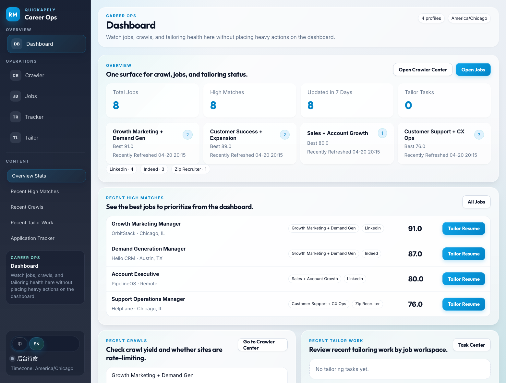
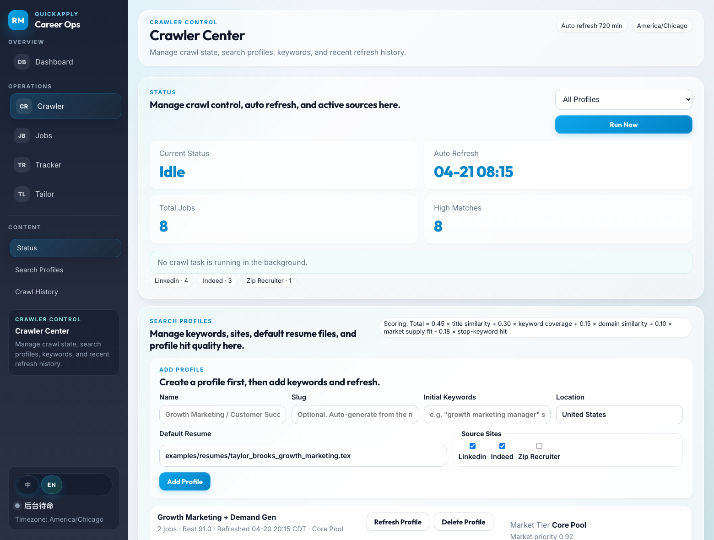
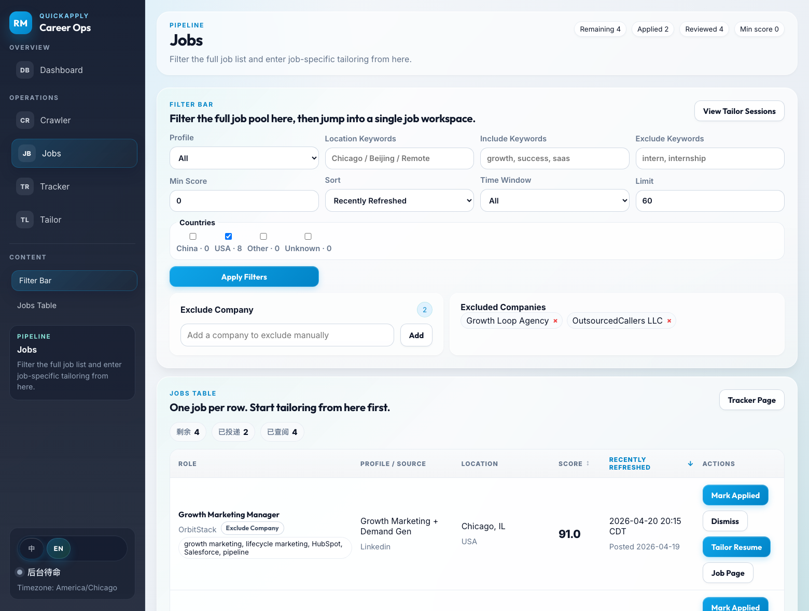
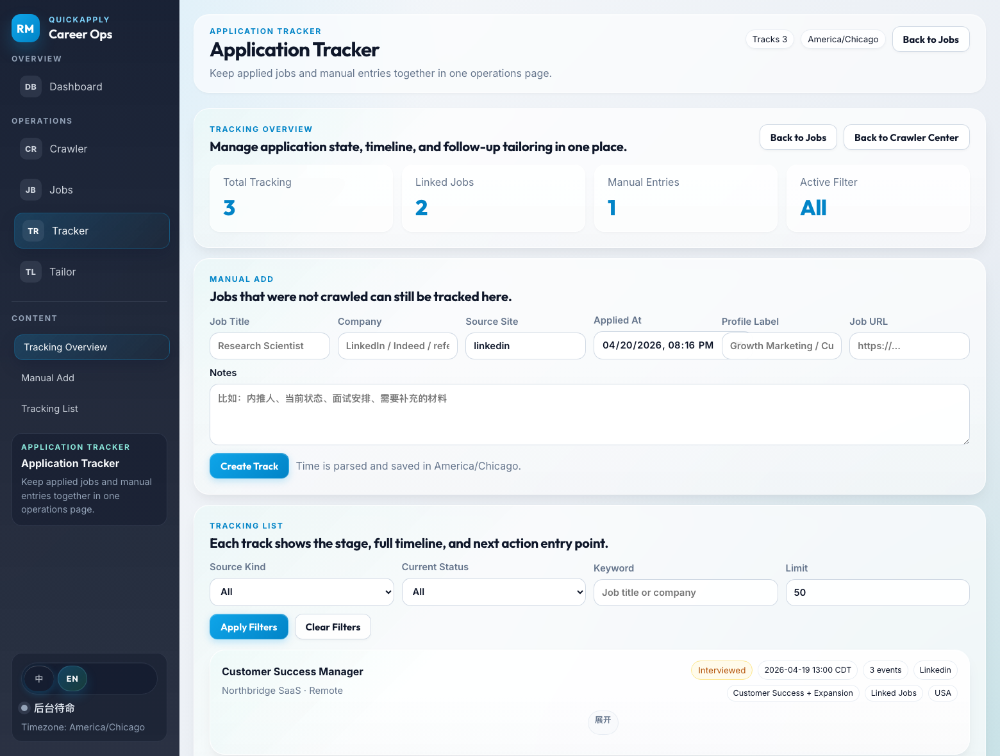

# Crawler, Jobs, and Tracker Workflow

[简体中文](./workflows.zh-CN.md)

## Dashboard

Use `Dashboard` as the top-level health view.

It summarizes:

- recent high matches
- recent crawl runs
- recent tracker activity
- recent tailoring activity

## Crawler

Use `Crawler` to manage search profiles and run refreshes.

Main tasks:

- add a profile
- edit search keywords
- edit locations
- choose source sites
- review crawl history

Important behavior:

- JobSpy can return empty results even if you can open the website manually in Chrome
- LinkedIn and Indeed can rate-limit repeated runs
- crawl history is the main place to verify whether a keyword/source combination is productive

## Jobs

Use `Jobs` to review the full pool.

Main actions:

- filter by profile, keyword, location, score, recency, and country
- open the original job page
- exclude noisy companies
- dismiss jobs
- mark jobs as applied
- open Tailor for a job

By design:

- jobs marked as applied no longer stay in the remaining pool
- dismissed jobs count as reviewed
- excluded companies are hidden on future crawls

## Tracker

Use `Tracker` for the application timeline.

Two entry paths:

- automatic tracks from `Mark Applied`
- manual entries for referral or off-platform roles

Each track can store:

- current stage
- time of stage change
- notes
- event history

